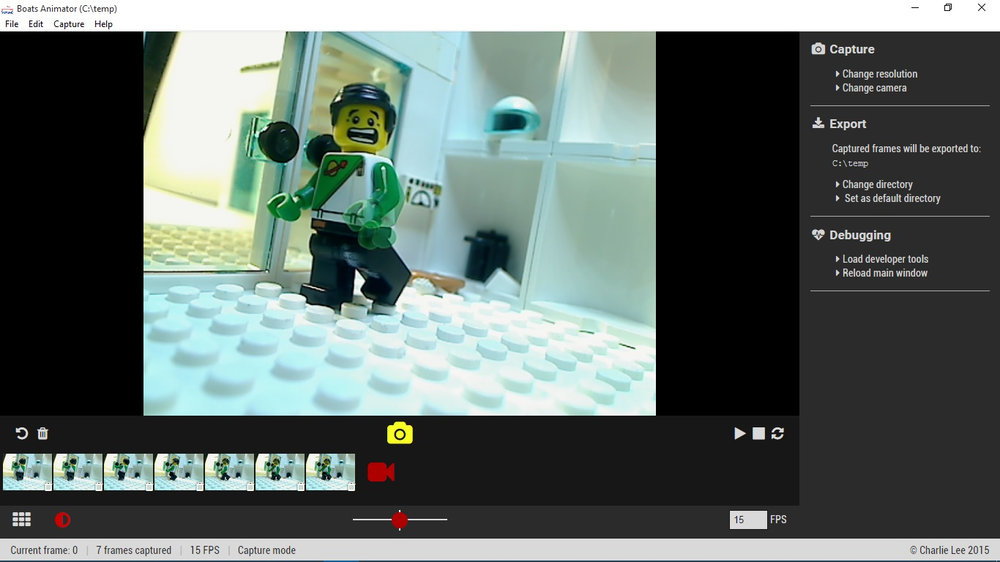

## Introduction

**Boats Animator** is a free and open-source stop motion animation program for Windows, macOS and Linux. Its intuitive interface caters to animators of all levels and offers many powerful features. The program has been open sourced under the GNU General Public License and contributions are welcome to the project's active [GitHub repository]({{ page.repository }}).

## Features

### Instant Playback

 Instantly preview your captured frames with Boats Animator. Unlike other programs, there is no need to wait for the frames to process.

### Onion Skinning

 This professional feature helps keep your animations smooth by showing you a translucent version of the last image captured. 

### High resolution and multi device support

 Boats Animator supports high resolution frame capture, including 1080p and beyond! It's also simple to switch between multiple connected devices for multi-camera shots.

### For Windows, macOS and Linux

 Boats Animator is built with [web technologies](http://nwjs.io/) which means it runs equally well on all major desktop operating systems.

### Open Source

 With an open-source code base, new features are always being added to Boats Animator by people **just like you**. [Your suggestions]({{ page.repository }}/issues) and contributions improve Boats Animator for everyone.

## Downloads

| Windows | macOS | Linux |
| - | - | - |
| [Boats Animator {{ page.version }} installer]({{ page.repository }}/releases/download/v{{ page.version }}/Boats-Animator-{{ page.version }}-Setup.exe) | [Boats Animator {{ page.version }} .zip file]({{ page.repository }}/releases/download/v{{ page.version }}/Boats-Animator-{{ page.version }}-osx-x64.zip) | [Boats Animator {{ page.version }} .tar.gz (64 bit)]({{ page.repository }}/releases/download/v{{ page.version }}/Boats-Animator-{{ page.version }}-linux-x64.tar.gz) |
| [Boats Animator {{ page.version }} .zip file]({{ page.repository }}/releases/download/v{{ page.version }}/Boats-Animator-{{ page.version }}-win-ia32.zip) | | [Boats Animator {{ page.version }} .tar.gz (32 bit)]({{ page.repository }}/releases/download/v{{ page.version }}/Boats-Animator-{{ page.version }}-linux-ia32.tar.gz) |

#### Other

<ul class="plainlist">
  <li><a href="{{ page.repository }}/releases">Other downloads and release information</a></li>
  <li><a href="http://boatsanimator.readthedocs.io/en/latest/introduction/system-requirements/">System requirements</a></li>
  <li><a href="http://boatsanimator.readthedocs.io/">Documentation</a></li>
  <li><a href="{{ page.repository }}">GitHub Repository</a></li>
</ul>

## Recent News
{{ page.category }}

<article class="item">
  <h2><a href="{{ post.url }}">{{ post.title }}</a></h2>
  <h4>{{ post.date | date: "%-d %B %Y" }}</h4>
  
{{ post.excerpt }}

</article>


<a href="/category/boats-animator" class="button">Older posts</a>
