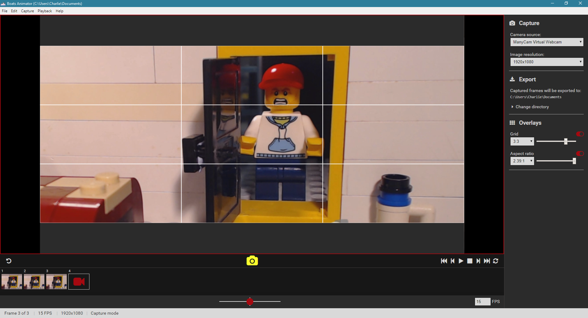
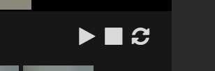
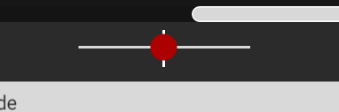
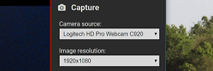
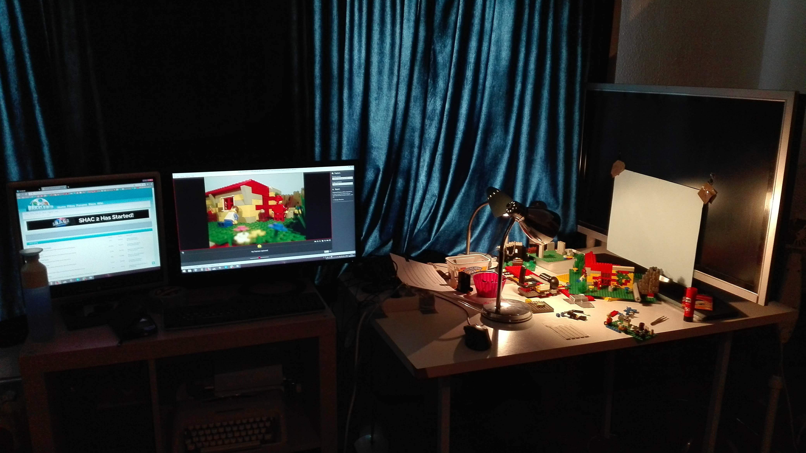
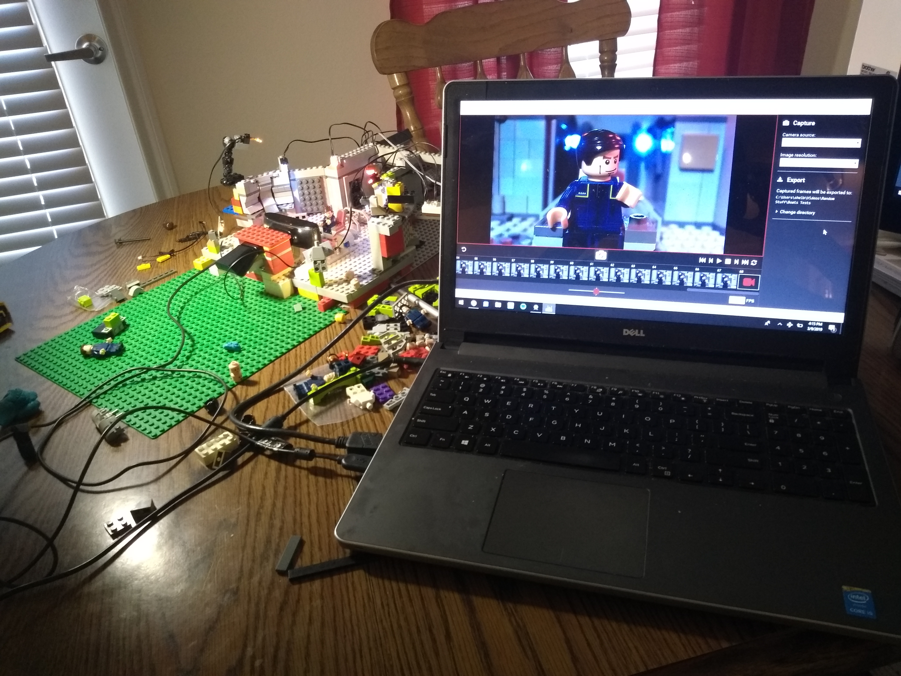

# Introduction

**Boats Animator** is a free and open-source stop motion animation program for Windows, macOS and Linux. Its intuitive interface caters to animators of all levels and offers many powerful features. The program has been open sourced under the GNU General Public License and contributions are welcome to the project's active [GitHub repository]({{ page.repository }}).

# Features

## Instant Playback

 Instantly preview your captured frames with Boats Animator. Unlike other programs, there is no need to wait for the frames to process.

## Onion Skinning

 This professional feature helps keep your animations smooth by showing you a translucent version of the last image captured. 

## High resolution and multi device support

 Boats Animator supports high resolution frame capture, including 1080p and beyond! It's also simple to switch between multiple connected devices for multi-camera shots.

## For Windows, macOS and Linux

 Boats Animator is built with [web technologies](http://nwjs.io/) which means it runs equally well on all major desktop operating systems.

## Open Source

 With an open-source code base, new features are always being added to Boats Animator by people **just like you**. [Your suggestions]({{ page.repository }}/issues) and contributions improve Boats Animator for everyone.

# Downloads

| Windows | macOS | Linux |
| - | - | - |
| [Boats Animator {{ page.version }} installer]({{ page.repository }}/releases/download/v{{ page.version }}/boats-animator-{{ page.version }}-setup.exe) | [Boats Animator {{ page.version }} .zip file]({{ page.repository }}/releases/download/v{{ page.version }}/boats-animator-{{ page.version }}-osx64.zip) | [Boats Animator {{ page.version }} .tar.gz (64 bit)]({{ page.repository }}/releases/download/v{{ page.version }}/boats-animator-{{ page.version }}-linux64.tar.gz) |
| [Boats Animator {{ page.version }} .zip file]({{ page.repository }}/releases/download/v{{ page.version }}/boats-animator-{{ page.version }}-win32.zip) | | [Boats Animator {{ page.version }} .tar.gz (32 bit)]({{ page.repository }}/releases/download/v{{ page.version }}/boats-animator-{{ page.version }}-linux32.tar.gz) |

#### Reported Issues

* **Note for Ubuntu 18.04 users:** I have received reports of issues launching the program on Ubuntu 18.04. This is due to a missing dependency, please run "sudo apt-get install libgconf-2-4" and the program should launch.

#### Reported Issues

* **Note for Ubuntu 18.04 users:** I have received reports of issues launching the program on Ubuntu 18.04. This is due to a missing dependency, please run "sudo apt-get install libgconf-2-4" and the program should launch.
* **Note for macOS 10.14 users:** the program seems to currently fail to launch on macOS 10.14. This issue is being [tracked on GitHub](https://github.com/charlielee/boats-animator/issues/248) and hopefully can be fixed soon.

### Other

<ul class="plainlist">
  <li><a href="{{ page.repository }}/releases">Other downloads and release information</a></li>
  <li><a href="http://boatsanimator.readthedocs.io/en/latest/introduction/system-requirements/">System requirements</a></li>
  <li><a href="http://boatsanimator.readthedocs.io/">Documentation</a></li>
  <li><a href="{{ page.repository }}">GitHub Repository</a></li>
</ul>

# User Testimonials

Here's what people think of Boats Animator! All of the photos below were taken by the users themselves.

## Bert Loos

[https://www.youtube.com/tehbertl](https://www.youtube.com/tehbertl)

*"It's very user-friendly, fast, and has a minimal design that keeps me focused on animating. I also like that it's able to utilize the maximum resolution my webcam outputs..."*

## Shelby Pritchard

[https://www.youtube.com/user/pritchardstudios](https://www.youtube.com/user/pritchardstudios)

*"I use it for brickfilming, Lego stop-motion animation, and love that it is a free capture program that allows easy preview, camera selection, and most importantly, 1080p capture."*

## Catalin Chelariu - Softpedia

[https://www.softpedia.com/get/Multimedia/Video/Other-VIDEO-Tools/Boats-Animator.shtml](https://www.softpedia.com/get/Multimedia/Video/Other-VIDEO-Tools/Boats-Animator.shtml)

*"On the whole, this program looks very promising, and we were mostly impressed by its intuitive, novice-friendly design. Once the missing features are implemented, this will be an excellent alternative to overly complex or expensive stop-motion animation tools."*

## Ryan

*"I love the onion skinning... ...I'm glad I found this as it's something that still being worked on!"*

# Recent News
{{ page.category }}

<article class="item">
  <h2><a href="{{ post.url }}">{{ post.title }}</a></h2>
  <h4>{{ post.date | date: "%-d %B %Y" }}</h4>
  
{{ post.excerpt }}

</article>


<a href="/category/boats-animator" class="button">More posts</a>
